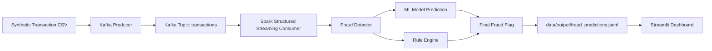

# Real-time Fraud Detection for E-wallet Transactions

This project is a local end-to-end demo of real-time fraud detection inspired by e-wallet fraud monitoring patterns.

It combines:
- Kafka producer for streaming transaction events
- Spark Structured Streaming for real-time consumption
- Machine Learning model (Random Forest)
- Rule-based risk engine
- Streamlit dashboard for monitoring fraud alerts

The system detects:
- Unusual login behavior
- Transactions to blacklist accounts
- Large transactions
- Rapid repeated transfers

## 1. Architecture



## 2. Project Structure

```text
main.py
requirements.txt
README.md
data/
	blacklist/
		blacklist_accounts.csv
	raw/
		transactions_synthetic.csv
	processed/
		transactions_processed.csv
	output/
		fraud_predictions.jsonl
docker/
	docker-compose.yml
src/
	preprocessing/
		generate_synthetic_data.py
		preprocess_data.py
	features/
		feature_engineering.py
	model/
		train_model.py
		predict_model.py
		saved_model/
			fraud_model.pkl
	rules/
		rule_engine.py
	detection/
		fraud_detector.py
	producer/
		kafka_producer.py
	streaming/
		spark_streaming_job.py
	dashboard/
		app.py
```

## 3. Setup

### 3.1 Prerequisites
- Python 3.10+
- Docker Desktop (for Kafka)
- Java 8+ (required by Spark)

### 3.2 Install dependencies

```bash
python -m pip install --upgrade pip
python -m pip install -r requirements.txt
```

### 3.3 Start Kafka locally

From project root:

```bash
docker compose -f docker/docker-compose.yml up -d
```

Check Kafka container status:

```bash
docker ps
```

## 4. Data + Model Preparation

### Option A: One command via main orchestrator

```bash
python main.py prepare-data --rows 2500 --seed 42
python main.py train-model
```

### Option B: Run each module directly

```bash
python -m src.preprocessing.generate_synthetic_data --rows 2500 --output data/raw/transactions_synthetic.csv
python -m src.preprocessing.preprocess_data --input data/raw/transactions_synthetic.csv --output data/processed/transactions_processed.csv
python -m src.model.train_model --input data/processed/transactions_processed.csv --output src/model/saved_model/fraud_model.pkl
```

## 5. Run Real-time Pipeline

### 5.1 Start Spark streaming consumer

Terminal 1:

```bash
python main.py run-streaming
```

### 5.2 Stream transactions into Kafka

Terminal 2:

```bash
python main.py run-producer --limit 300 --delay 0.2
```

### 5.3 Start dashboard

Terminal 3:

```bash
streamlit run src/dashboard/app.py
```

Open browser at the URL printed by Streamlit (usually http://localhost:8501).

## 6. Quick Demo Command

This command starts streaming consumer as a subprocess, streams sample transactions, then stops the consumer.

```bash
python main.py run-demo --limit 250 --delay 0.2
```

## 7. Expected Output

### Console from Spark streaming
For each micro-batch, you should see rows including:
- event_time
- nameOrig / nameDest
- type
- amount
- ml_prediction
- rule_flag
- final_flag

Example:

```text
=== BATCH 3 ===
				 event_time nameOrig    nameDest     type   amount  ml_prediction  rule_flag  final_flag
2025-01-01 09:12:10  C100021 M1979787155 TRANSFER 450000.0              1          1           1
2025-01-01 09:12:24  C100344   M20011321  PAYMENT   3200.0              0          0           0
```

### Output file for dashboard
- File: data/output/fraud_predictions.jsonl
- Contains all scored events with ML and rule flags.

### Dashboard
- Total transactions
- Fraud transactions
- Fraud rate
- Fraud breakdown by type
- Latest fraud events table

## 8. Rule + ML Fusion Logic

In fraud detection:
- ml_prediction = model.predict(features)
- rule_flag = OR of rules (blacklist, large amount high-risk type, unusual login, rapid transfers)
- final_flag = OR(ml_prediction, rule_flag)

Mathematically:

$$
	ext{final\_flag} = \mathbb{1}(\text{ml\_prediction}=1 \lor \text{rule\_flag}=1)
$$

## 9. Stop Services

Stop Kafka:

```bash
docker compose -f docker/docker-compose.yml down
```

## 10. Optional Extensions

- Persist scored records to PostgreSQL
- Add model retraining schedule
- Add alert channels (email/webhook)
- Add drift monitoring for transaction patterns
